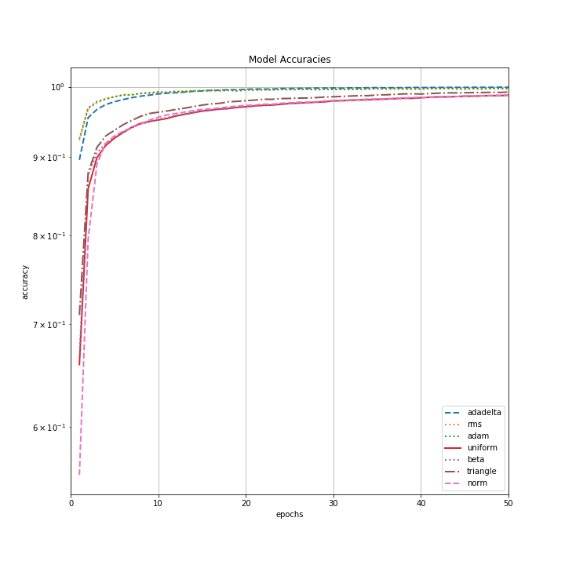
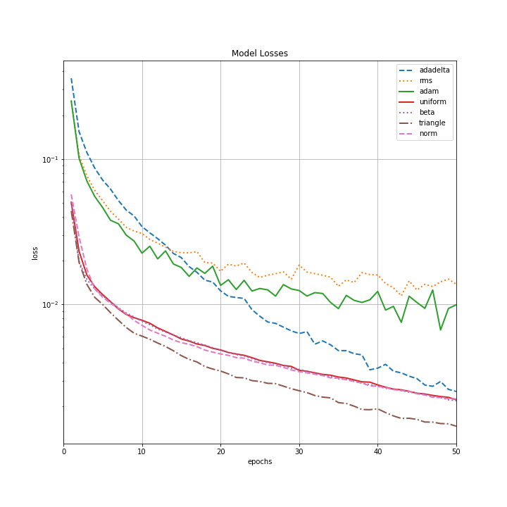

# StochasticLearningRates
A research project experimenting with randomly distributed (various distributions) learning rates applied to a deep neural network trained on the MNIST-10 research dataset.

